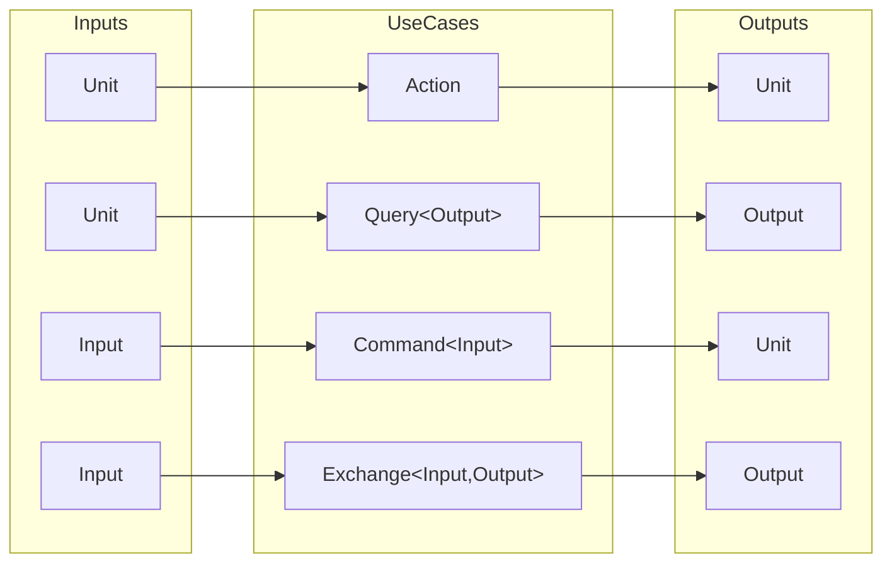

# UseCase

[](https://medium.com/@numq/a-recipe-for-the-perfect-use-case-3a3057930251)
[](https://dev.to/numq/a-recipe-for-the-perfect-use-case-5201)

A curated collection of architectural patterns for business logic in Kotlin. This project demonstrates how to implement
the UseCase pattern using different error-handling strategies while maintaining a clean, symmetric API.



## Table of Contents

- [The Problem](#the-problem)
- [Implementations](#implementations)
    - [Arrow (Typed Errors)](#arrow-typed-errorssrcmainkotliniogithubnumqusecasearrowusecasekt---recommended)
    - [Result (Standard Wrapper)](#result-standard-wrappersrcmainkotliniogithubnumqusecaseresultusecasekt)
    - [Raw (Direct Execution)](#raw-direct-executionsrcmainkotliniogithubnumqusecaserawusecasekt)
- [Why use this?](#why-use-this)
- [Usage](#usage)
- [License](#license)

## The Problem

In Kotlin, you cannot overload generics by the number of type parameters. This project solves the issue of handling
`Unit` as `Input` or `Output` without polluting the implementation with boilerplate, using a `sealed interface`
hierarchy.

### CQRS at the Function Level

While traditional CQRS separates reads and writes at the service or database level, this pattern applies the same
principle at the UseCase level:

- **Action** — fire and forget (no input, no output)
- **Query** — read operation (no input, returns result)
- **Command** — write operation (takes input, returns nothing)
- **Exchange** — combined read-write (takes input, returns result)

This gives you the benefits of CQRS (clarity, separation of concerns) without the infrastructure complexity.

## Implementations

### **[Arrow (Typed Errors)](./src/main/kotlin/io/github/numq/usecase/arrow/UseCase.kt)** - recommended

The most robust version, leveraging Arrow-kt and its Raise DSL for type-safe error handling. It transforms exceptions
into values using Either.

- **Typed Errors:** Errors are part of the signature via `Either<Throwable, T>`.
- **Raise DSL:** Uses Arrow's computation blocks for clean error propagation.
- **No Exceptions:** Business errors become values, not stack traces.

### **[Result (Standard Wrapper)](./src/main/kotlin/io/github/numq/usecase/result/UseCase.kt)**

A pragmatic approach using Kotlin's built-in Result type. It uses runCatching to safely wrap execution.

- **Safety:** Automatically catches exceptions and wraps them in a Result.

- **Zero Dependencies:** Uses only the Kotlin Standard Library.

### **[Raw (Direct Execution)](./src/main/kotlin/io/github/numq/usecase/raw/UseCase.kt)**

> [!WARNING]  
> This variant does not handle errors. Exceptions propagate directly to the caller.
> Use only when you have a global exception handler (e.g., coroutine exception handler).

The most minimalist version. It calls functions directly and throws exceptions if something goes wrong.

- **Performance:** Zero overhead from wrappers.

- **Simplicity:** Ideal for simple projects where global exception handling is preferred.

## Why use this?

- **Type Safety:** Eliminates the need to pass `Unit` as an argument.

- **Consistency:** All use cases across your project follow the same structure.

- **Readability:** Specialized interfaces like `Query` or `Command` make the intent of the code clear at a glance.

## Usage

<details open>
<summary><b>Arrow (Typed Errors)</b> - recommended</summary>

### **[View Definition](./src/main/kotlin/io/github/numq/usecase/arrow/UseCase.kt)**

#### Action

```kotlin
interface AuthenticationService {
    suspend fun clearSession(): Either<Throwable, Unit>
}

class Logout(private val service: AuthenticationService) : UseCase.Action {
    override suspend fun Raise<Throwable>.action() = service.clearSession().bind()
}
```

#### Query

```kotlin
interface ProductService {
    suspend fun getProducts(): Either<Throwable, List<Product>>
}

class ListProducts(private val service: ProductService) : UseCase.Query<List<Product>> {
    override suspend fun Raise<Throwable>.query() = service.getProducts().bind()
}
```

#### Command

```kotlin
interface ProfileService {
    suspend fun uploadImage(id: String, url: String): Either<Throwable, Unit>
}

class UpdateAvatar(private val service: ProfileService) : UseCase.Command<UpdateAvatar.Input> {
    data class Input(val id: String, val url: String)

    override suspend fun Raise<Throwable>.command(input: Input) = with(input) {
        service.uploadImage(id = id, url = url).bind()
    }
}
```

#### Exchange

```kotlin
interface AuthenticationService {
    suspend fun signIn(email: String): Either<Throwable, Credentials>
}

class LoginWithEmail(private val service: AuthenticationService) : UseCase.Exchange<LoginWithEmail.Input, Credentials> {
    data class Input(val email: String)

    override suspend fun Raise<Throwable>.exchange(input: Input) = service.signIn(email = input.email).bind()
}
```

</details>

<details>
<summary><b>Result (Standard Wrapper)</b></summary>

### **[View Definition](./src/main/kotlin/io/github/numq/usecase/result/UseCase.kt)**

#### Action

```kotlin
interface AuthenticationService {
    suspend fun clearSession(): Result<Unit>
}

class Logout(private val service: AuthenticationService) : UseCase.Action {
    override suspend fun action() = service.clearSession().getOrThrow()
}
```

#### Query

```kotlin
interface ProductService {
    suspend fun getProducts(): Result<List<Product>>
}

class ListProducts(private val service: ProductService) : UseCase.Query<List<Product>> {
    override suspend fun query() = service.getProducts().getOrThrow()
}
```

#### Command

```kotlin
interface ProfileService {
    suspend fun uploadImage(id: String, url: String): Result<Unit>
}

class UpdateAvatar(private val service: ProfileService) : UseCase.Command<UpdateAvatar.Input> {
    data class Input(val id: String, val url: String)

    override suspend fun command(input: Input) = with(input) {
        service.uploadImage(id = id, url = url).getOrThrow()
    }
}
```

#### Exchange

```kotlin
interface AuthenticationService {
    suspend fun signIn(email: String): Result<Credentials>
}

class LoginWithEmail(private val service: AuthenticationService) : UseCase.Exchange<LoginWithEmail.Input, Credentials> {
    data class Input(val email: String)

    override suspend fun exchange(input: Input) = service.signIn(email = input.email).getOrThrow()
}
```

</details>

<details>
<summary><b>Raw (Direct Execution)</b></summary>

> [!WARNING]  
> This variant does not handle errors. Exceptions propagate directly to the caller.
> Use only when you have a global exception handler (e.g., coroutine exception handler).

**[View Definition](./src/main/kotlin/io/github/numq/usecase/raw/UseCase.kt)**

#### Action

```kotlin
interface AuthenticationService {
    suspend fun clearSession()
}

class Logout(private val service: AuthenticationService) : UseCase.Action {
    override suspend fun action() = service.clearSession()
}
```

#### Query

```kotlin
interface ProductService {
    suspend fun getProducts(): List<Product>
}

class ListProducts(private val service: ProductService) : UseCase.Query<List<Product>> {
    override suspend fun query() = service.getProducts()
}
```

#### Command

```kotlin
interface ProfileService {
    suspend fun uploadImage(id: String, url: String)
}

class UpdateAvatar(private val service: ProfileService) : UseCase.Command<UpdateAvatar.Input> {
    data class Input(val id: String, val url: String)

    override suspend fun command(input: Input) = with(input) {
        service.uploadImage(id = id, url = url)
    }
}
```

#### Exchange

```kotlin
interface AuthenticationService {
    suspend fun signIn(email: String): Credentials
}

class LoginWithEmail(private val service: AuthenticationService) : UseCase.Exchange<LoginWithEmail.Input, Credentials> {
    data class Input(val email: String)

    override suspend fun exchange(input: Input) = service.signIn(email = input.email)
}
```

</details>

## License

This project is licensed under the MIT License - see the [LICENSE](LICENSE) file for details.

___

<p align="center">
  <a href="https://numq.github.io/support">
    
  </a>
  <br>
  <a href="https://numq.github.io/support" style="text-decoration: none;">
    <code><font color="#bb9af7">numq.github.io/support</font></code>
  </a>
</p>